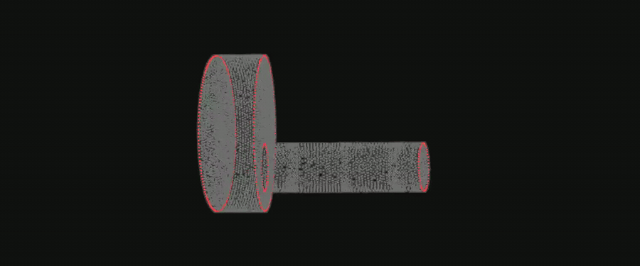
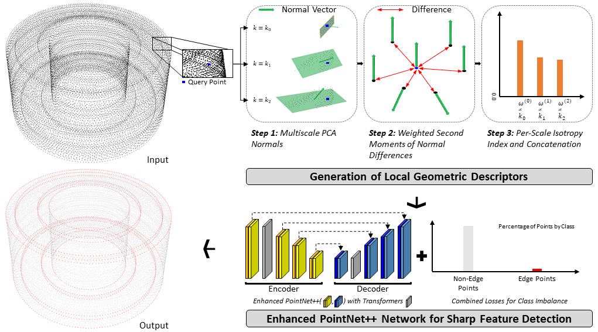
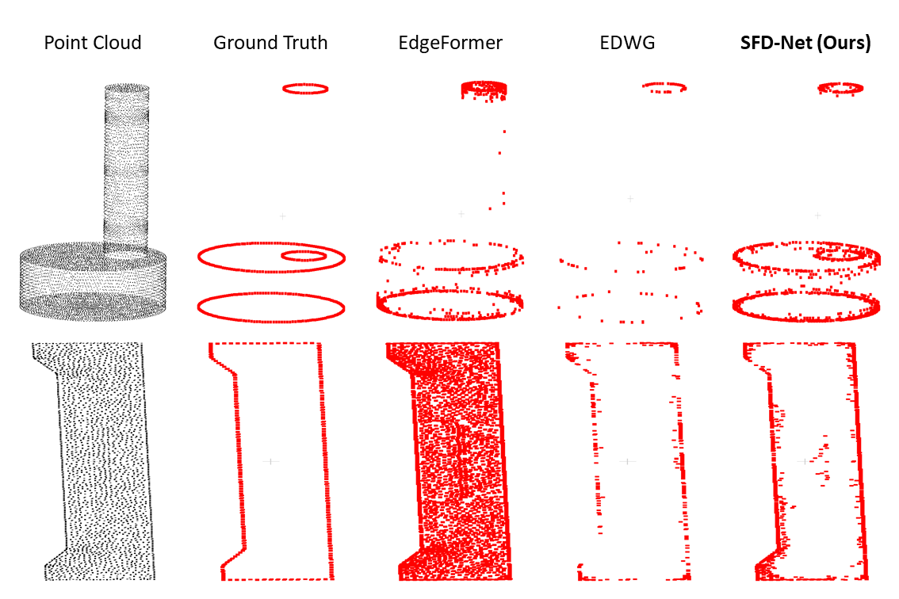
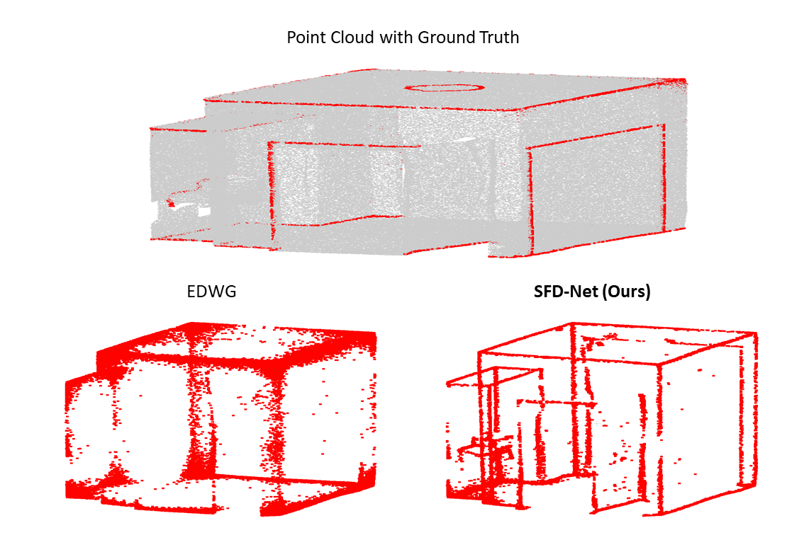
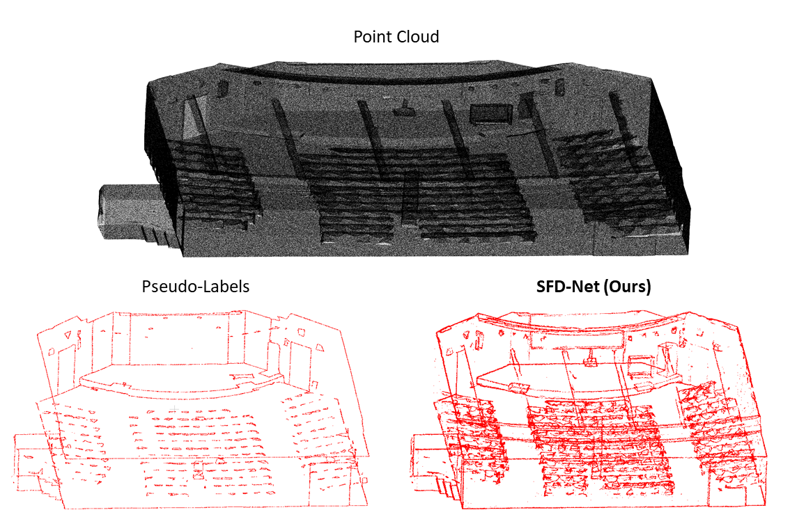

# SFD-Net: Sharp Feature Detection Network Based on Local Geometric Features

<p align="center">
  <a href="#"></a>
  <a href="#"></a>
  <a href="https://inyoungoh-cde.github.io/SFD-Net/"></a>
  <a href="#citation"></a>
</p>

<p align="center">
  
</p>
<p align="center"><em>Ground-truth sharp features (red) cross-fade into SFD-Net's prediction &mdash; green correct, red false alarm, orange missed &mdash; over one revolution. <b><a href="https://inyoungoh-cde.github.io/SFD-Net/">Try it live</a></b>: drag the GT&#8596;prediction divider and scrub the noise level yourself on the project page.</em></p>

> **TL;DR.** Sharp features are where the surface-normal field is discontinuous. SFD-Net detects them with a compact, **architecture-agnostic** geometric descriptor (LGD) that you prepend, unmodified, to an existing point-cloud backbone. It reaches state-of-the-art F1 on ABC across four density-and-noise conditions, lifts three independent backbones in a plug-and-play way, and transfers zero-shot from synthetic CAD to real scans.

---

## One principle, not one tool

I don't treat sharp-feature detection as owning a single network. The approach is a way of working: **find the geometric relation a model gets wrong, then supply the explicit cue that fixes it.** Here that relation is the discontinuity of the surface-normal field, and the cue is a small multi-scale descriptor. The descriptor, not any backbone-specific tuning, is what drives the gains, which is exactly why it carries across architectures and into new problems.

---

## Method: the Local Geometric Descriptor (LGD)

<p align="center">
  
  <!-- Source: Fig. 2 (method overview) from the paper. -->
</p>
<p align="center"><em>LGD turns local geometry into a three-value cue at three nested scales, concatenated with raw coordinates and fed to an enhanced PointNet++.</em></p>

LGD turns each point into a 3-number cue in three steps:

1. **Multi-scale PCA normals.** Estimate a unit normal at three nested neighborhoods `k = 20, 40, 80`. Only directions are kept (no orientation propagation), giving sign-flip invariance.
2. **Second moments of normal differences.** Accumulate weighted outer products of normal differences `Δn Δnᵀ` per scale. Because this uses `Δn Δnᵀ`, the descriptor is invariant to rigid motion, global scale, and normal sign flips, with no explicit alignment.
3. **Per-scale isotropy index.** Collapse each scale's tensor to one isotropy value (low on planar patches, high near creases and corners) and concatenate the three into `φ ∈ ℝ³`.

The three scales are complementary: the smallest gives acuity on narrow creases, the middle balances localization and stability, the largest suppresses variance from noise and undersampling.

`φ` is concatenated with raw coordinates and fed to an **enhanced PointNet++** (encoder–decoder with two lightweight Transformer blocks) trained with an imbalance-aware **Focal-Tversky + Dice** loss. LGD is precomputed and **attaches to any backbone that accepts per-point channels**, so it works as a drop-in module rather than a fixed architecture.

---

## Results

### State of the art on ABC (Average F1 ↑ / FPR ↓)

Four conditions: density variation only (`none`), then increasing Gaussian noise. Best in **bold**.

| Method        | none F1 / FPR | 0.12% F1 / FPR | 0.6% F1 / FPR | 1.2% F1 / FPR |
|---------------|:-------------:|:--------------:|:-------------:|:-------------:|
| PointNet++    | 50.89 / 48.57 | 55.02 / 45.88  | 49.03 / 49.35 | 50.21 / 49.01 |
| DGCNN         | 49.89 / 48.90 | 50.65 / 48.51  | 48.44 / 49.58 | 47.53 / 49.99 |
| RepSurf       | 55.23 / 45.96 | 57.16 / 43.06  | 54.21 / 46.55 | 48.17 / 49.73 |
| PointMLP      | 54.59 / 46.30 | 47.53 / 50.00  | 47.52 / 50.01 | 47.65 / 49.94 |
| PIE-Net       | 52.55 / 38.50 | 52.44 / 37.35  | 47.61 / 40.54 | 49.56 / 39.33 |
| BoundED       | 48.12 / 49.88 | 47.98 / 49.94  | 47.97 / 49.90 | 47.70 / 49.98 |
| SFC-Net       | 47.92 / 49.84 | 48.64 / 49.53  | 48.27 / 49.69 | 48.03 / 49.80 |
| MSL-Net       | 59.41 / –     | 59.11 / –      | 56.11 / –     | 52.74 / –     |
| EdgeFormer    | 52.04 / 31.24 | 48.66 / 33.95  | 34.99 / 45.16 | 28.13 / 48.55 |
| EDWG          | 54.95 / 46.06 | 54.93 / 46.07  | 48.20 / 49.81 | 47.76 / 49.90 |
| **SFD-Net**   | **61.33** / 36.93 | **60.42** / 39.76 | **58.62** / 40.88 | **57.05** / 41.94 |

SFD-Net leads F1 in every condition while keeping FPR among the lowest.

<p align="center">
  
  <!-- Source: Fig. 4 (or a Ground Truth + SFD-Net + one baseline crop). -->
</p>
<p align="center"><em>ABC (synthetic CAD). EdgeFormer over-detects on smooth faces and EDWG misses structure, while SFD-Net stays close to ground truth.</em></p>

### Architecture-agnostic: plug-and-play on three backbones (ABC `none`)

Prepending LGD, with no architectural change, improves all three backbones. This is the core point: the **descriptor** drives the gains.

| Backbone            | F1 ↑      | FPR ↓     | ΔF1     | ΔFPR    |
|---------------------|:---------:|:---------:|:-------:|:-------:|
| PointNet++          | 50.89     | 48.57     | –       | –       |
| + LGD               | **57.89** | **43.70** | +7.00   | −4.87   |
| RepSurf             | 55.23     | 45.96     | –       | –       |
| + LGD               | **59.28** | **43.34** | +4.05   | −2.62   |
| EDWG                | 54.95     | 46.06     | –       | –       |
| + LGD               | **60.80** | **36.98** | +5.85   | −9.08   |

`LGD + EDWG` (60.80 F1) nearly matches full SFD-Net (61.33), confirming the multi-scale isotropy descriptor is the primary driver of the gains.

### Zero-shot transfer: CAD → real scans

<p align="center">
  
  <!-- Source: Fig. 5 / Fig. S10 (auditorium). -->
</p>
<p align="center"><em>Zero-shot on a real S3DIS room. EDWG floods flat surfaces with false positives; SFD-Net recovers clean wall, partition, and furniture edges.</em></p>

Trained only on 10K-point synthetic CAD, SFD-Net is applied directly to real S3DIS scenes (363K to 7.1M points, up to ~710× the training point count) with no retraining, fine-tuning, or subsampling. It recovers wall, partition, furniture, and tiered-seat boundaries while suppressing activations on flat surfaces, where competing methods either miss most structure or flood flat regions with false positives.

<p align="center">
  
</p>
<p align="center"><em>Zero-shot on a 7.1M-point auditorium (~710&times; the training scale). Semantic-boundary pseudo-labels (left) capture only coarse room edges; SFD-Net (right) also recovers the tiered-seat and platform geometry.</em></p>

---

## What LGD is (and isn't)

- **Complementary, not a replacement.** LGD supplies an explicit geometric cue alongside a learned backbone; it does not replace learned features.
- **A precomputed descriptor.** LGD is computed from local geometry and fed to the network; the pipeline is not end-to-end differentiable. Replacing the PCA step with a learned estimator is future work.
- **Architecture-agnostic by design.** Gains come from the descriptor, so it transfers across backbones rather than being tied to one.

---

## Getting started

The pipeline ships in two parts, matching the two stages of the method:

- [`LGD/`](LGD/) — the standalone LGD descriptor extractor (C++), with a
  ready-to-run Windows build on the [Releases](../../releases) page.
- [`SFDNet/`](SFDNet/) — training and evaluation code for the network
  (PyTorch), with environment setup, data preparation and the trained
  checkpoints for all four ABC noise conditions on the
  [Releases](../../releases) page.

```bash
git clone https://github.com/inyoungoh-cde/SFD-Net.git
cd SFD-Net/SFDNet   # see SFDNet/README.md for setup and usage
```

---

## Citation

> **Placeholder — to be replaced with the official ECCV 2026 citation once released.**

```bibtex
@inproceedings{oh2026sfdnet,
  title     = {SFD-Net: Sharp Feature Detection Network Based on Local Geometric Features},
  author    = {Oh, Inyoung and Ko, Kwang Hee},
  booktitle = {Proceedings of the European Conference on Computer Vision (ECCV)},
  year      = {2026}
}
```

---

## Acknowledgments

Project page template inspired by [Nerfies](https://nerfies.github.io) and the [Academic Project Page Template](https://github.com/eliahuhorwitz/Academic-project-page-template).
